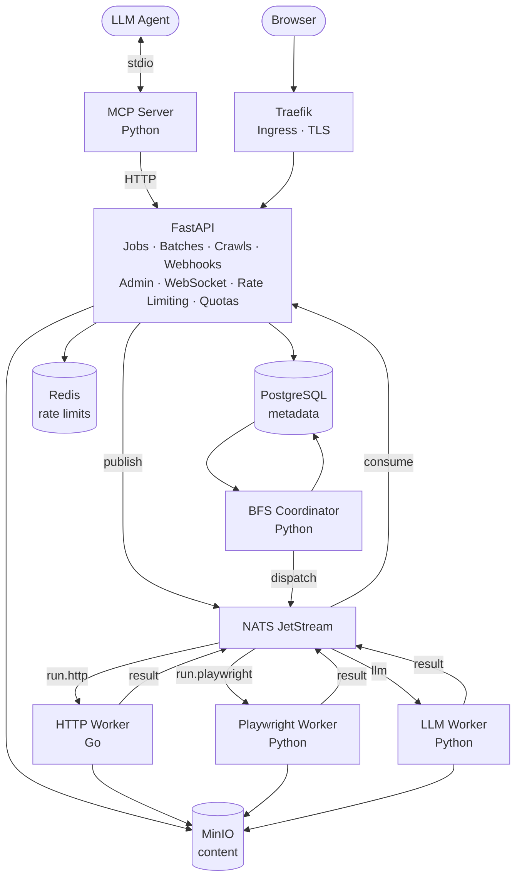

# ScrapeFlow

**A self-hosted, multi-tenant web scraping platform** — structured data extraction, change detection, and LLM-powered transformation. All data stays in your infrastructure.

---

## What it does

Submit a URL → get back clean data (HTML / Markdown / JSON). Schedule recurring jobs to detect changes. Extract structured data with your own LLM API key and schema. Crawl entire sites. Process URLs in batch. Watch job progress in real time via WebSocket. Connect LLM agents via MCP.

No per-seat pricing. No shared compute.

---

## Architecture



---

## Feature set

| Area | What's built |
|------|-------------|
| **Scraping engines** | Plain HTTP (Go) + Playwright JS rendering (Python); engine selected per job |
| **Output formats** | Raw HTML, cleaned Markdown, structured JSON |
| **LLM extraction** | User provides own Anthropic / OpenAI key + JSON schema; LLM worker extracts structured data |
| **Scheduling** | Cron-based recurring jobs; configurable intervals |
| **Change detection** | Per-run content hashing (xxh64); diff detection; webhook on change |
| **Batch scraping** | Submit hundreds of URLs in one request; per-item results + completion webhook |
| **Site crawl** | BFS coordinator; respects `max_depth` + `max_pages`; domain-scoped; dedup by URL |
| **Proxy rotation** | Per-job proxy credentials; `DEFAULT_PROXY_URL` fallback; Fernet-encrypted in NATS |
| **robots.txt** | Per-job `respect_robots` toggle; custom parsers in both Go + Python workers |
| **Authenticated scraping** | Per-job cookie injection; encrypted at rest in `job_secrets` table |
| **Page actions** | Click, type, wait, scroll, screenshot, `wait_for_selector`, `execute_js`, `set_viewport` |
| **Webhooks** | HMAC-signed; exponential-backoff retry; per-event filter; SSRF-safe re-validation |
| **Real-time tracking** | WebSocket `GET /jobs/{id}/watch` + `GET /batch/{id}/watch`; pg_notify fan-out |
| **Rate limiting** | Sliding-window per-user (Redis sorted set + Lua); batch-aware atomic deduction |
| **Quotas** | Per-user: monthly runs, concurrent jobs, storage bytes; admin override |
| **MCP server** | `scrape_url`, `get_result`, `get_job_status`, `list_jobs` — LLM-callable via stdio |
| **Admin SPA** | React dashboard: user management, job browser, usage stats, quota editor |
| **Multi-tenancy** | Clerk OAuth; JWT verification; tenant isolation (404, not 403, on cross-tenant access) |

---

## Stack

| Layer | Technology |
|-------|-----------|
| API | FastAPI + SQLAlchemy (async) + Alembic |
| HTTP worker | Go |
| Playwright / LLM worker | Python + Playwright |
| BFS coordinator | Python |
| MCP server | Python (`mcp` SDK, stdio transport) |
| Queue | NATS JetStream |
| Database | PostgreSQL 16 |
| Object storage | MinIO |
| Cache / rate limiting | Redis 7 |
| Auth | Clerk (OAuth: Google, GitHub) |
| Frontend | React + TypeScript + Vite |
| Gateway | Traefik |
| Production | k3s (namespace `scrapeflow`) + FluxCD GitOps |
| Local dev | Docker Compose |

---

## Quick start (Docker Compose)

**Prerequisites:** Docker, a [Clerk](https://clerk.com) application (free tier is fine)

```bash
git clone https://github.com/karthikgovindappa/scrapeflow
cd scrapeflow/docker

# Copy and fill in the environment file
cp .env.example .env
# Required: CLERK_SECRET_KEY, CLERK_AUTHORIZED_PARTY, CREDENTIALS_ENCRYPTION_KEY

docker compose up -d
```

The API is available at `http://localhost:8000`. Auto-migration runs on startup — no manual Alembic steps needed.

### Generate an encryption key

```bash
python -c "from cryptography.fernet import Fernet; print(Fernet.generate_key().decode())"
```

Set the output as `CREDENTIALS_ENCRYPTION_KEY` in your `.env`. This key encrypts proxy URLs and cookies before they enter the NATS message queue.

---

## Running tests

Tests run inside the Docker containers — the API uses `uv` to manage its virtualenv.

```bash
# from ./docker
docker compose exec api uv run pytest tests/ -v

# Single file
docker compose exec api uv run pytest tests/test_jobs.py -v

# MCP server (standalone image — not in docker-compose)
cd ..
docker build -t scrapeflow-mcp mcp/
docker run --rm -e SCRAPEFLOW_API_KEY=test-key scrapeflow-mcp python -m pytest tests/ -v
```

**Current test counts:** 239 API · 69 Playwright worker · 14 MCP

---

## Project structure

```
scrapeflow/
├── api/                  # FastAPI application
│   └── app/
│       ├── routers/      # jobs, batch, crawls, users, admin, health
│       ├── core/         # scheduler, result consumer, webhooks, quota, storage
│       ├── models/       # SQLAlchemy ORM models
│       └── schemas/      # Pydantic request/response schemas
├── http-worker/          # Go scrape worker
│   └── internal/
│       ├── worker/       # NATS consumer, message handler
│       ├── fetcher/      # HTTP client + proxy transport
│       └── robots/       # robots.txt parser
├── playwright-worker/    # Python Playwright worker
│   └── worker/
│       ├── worker.py     # NATS consumer + message handler
│       ├── actions.py    # 8-action executor with MinIO screenshots
│       └── robots.py     # robots.txt client (httpx, never proxy)
├── llm-worker/           # Python LLM extraction worker
├── coordinator/          # Python BFS crawl coordinator
│   └── coordinator/
│       ├── bfs.py        # dispatch loop + link extraction
│       └── result_handler.py
├── mcp/                  # MCP server (stdio)
│   └── tools/            # scrape_url, get_result, get_job_status, list_jobs
├── frontend/             # React + TypeScript admin SPA
│   └── src/
│       └── pages/        # Jobs, JobDetail, Users, UsageStats, ApiKeys
└── docker/               # Docker Compose + .env.example
```

---

## API overview

```
POST   /jobs                       Create a scrape job
GET    /jobs                       List jobs (paginated)
GET    /jobs/{id}                  Get job + latest run status
PATCH  /jobs/{id}                  Update job (schedule, engine, actions, proxy, …)
DELETE /jobs/{id}                  Cancel job
GET    /jobs/{id}/result           Get result content + warnings
GET    /jobs/{id}/runs             Run history
POST   /jobs/{id}/webhook-secret/rotate
WS     /jobs/{id}/watch            Real-time status stream

POST   /batch                      Submit batch (up to N URLs)
GET    /batch/{id}                 Batch status + counters
GET    /batch/{id}/items           Per-item results
WS     /batch/{id}/watch

POST   /crawls                     Start site crawl (BFS)
GET    /crawls/{id}                Crawl status
GET    /crawls/{id}/pages          Crawled pages (paginated, ?status=)
DELETE /crawls/{id}                Cancel crawl

GET    /users/me                   Current user
POST   /users/api-keys             Create API key
GET    /users/api-keys             List API keys
DELETE /users/api-keys/{id}        Revoke API key

GET    /admin/users                User list + search
DELETE /admin/users/{id}           Delete user + MinIO cleanup
GET    /admin/stats                Engine breakdown, run volume, top users
PATCH  /admin/users/{id}/quota     Override per-user limits
```

---

## Key design decisions

**Workers are DB-ignorant.** The API sends a fat NATS message containing everything the worker needs (URL, engine options, credentials, crawl context). Workers write output to MinIO, publish a result message, and never touch Postgres. All business logic — quota enforcement, dedup, diff detection, webhook dispatch — lives in the API's result consumer.

**Cancellation is API-enforced.** Workers are unaware of cancellations. When a job is cancelled, the result consumer checks `run.status` on receipt and discards the result silently. Workers can safely complete their work.

**Secrets are encrypted at the NATS boundary.** Proxy URLs and cookies are encrypted with Fernet before entering the message queue and decrypted only inside the worker process. Plaintext never touches NATS.

**Idempotent result processing.** Every result handler checks for terminal status before applying state transitions, so NATS redeliveries are safe. Storage quota increments, webhook delivery rows, and batch counters each have their own idempotency guard.

**BFS crawls survive API restarts.** The crawl coordinator is a separate Python process with its own NATS consumer and database session. The BFS queue is persisted in Postgres (`crawl_queue`), so a coordinator restart re-enqueues any stalled dispatched items automatically.

See [`docs/adr/`](docs/adr/) for the full Architecture Decision Record index.

---

## Production deployment

ScrapeFlow runs in a k3s homelab cluster at `scrapeflow.govindappa.com`.

- **Namespace:** `scrapeflow`
- **Ingress:** Traefik with TLS via cert-manager (Let's Encrypt)
- **DNS:** ExternalDNS + Cloudflare
- **GitOps:** FluxCD — manifests live in a separate infra repo
- **Migrations:** Alembic auto-runs on API pod startup

Workers are deployed as separate k3s Deployments. The HTTP worker uses `strategy: Recreate` to prevent the rolling-update window from deleting the durable NATS consumer before the new pod creates it.

---

## Docs

| Document | Purpose |
|----------|---------|
| [`docs/adr/`](docs/adr/) | Architecture Decision Records (ADR-001 → ADR-007) |
| [`docs/project/COMMANDS.md`](docs/project/COMMANDS.md) | Dev and ops command reference |
| [`docs/project/DEVOPS_SPEC.md`](docs/project/DEVOPS_SPEC.md) | k3s deployment spec |
| [`docs/archive/phase3/production-review.md`](docs/archive/phase3/production-review.md) | Phase 3 hardening review (52 findings, all resolved) |

---

## License

MIT
